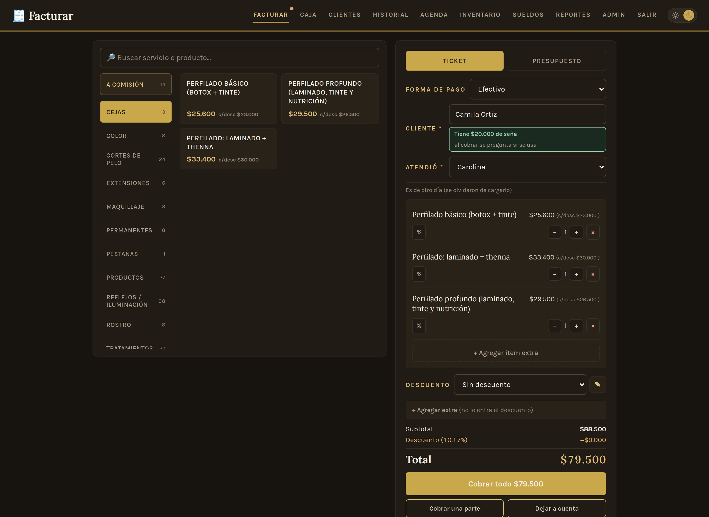
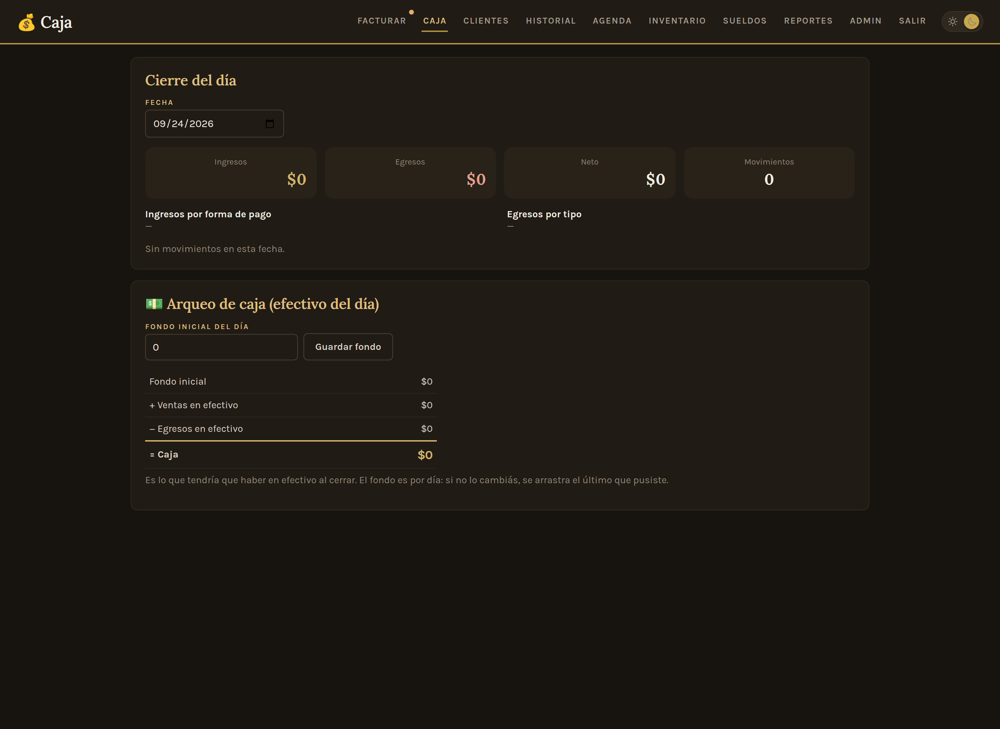
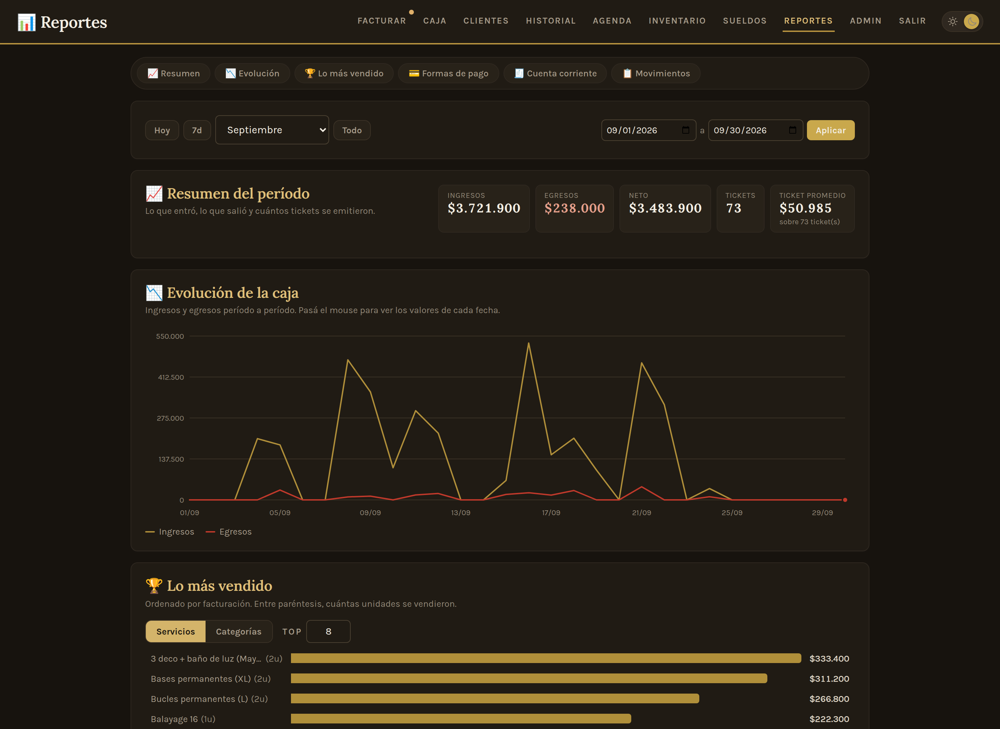
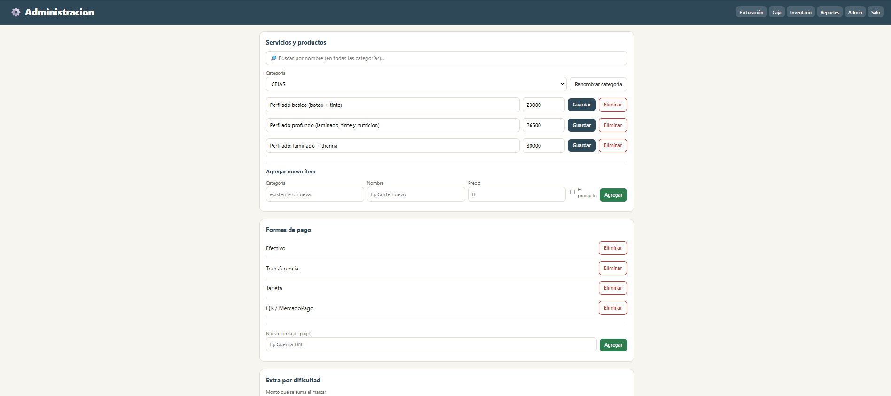

# App para peluquería — Sistema de gestión para comercios

Aplicación web full-stack para la gestión diaria de un comercio: facturación, caja, inventario, reportes y administración, con control de acceso por roles. Pensada y construida para uso real en un negocio.

Diseñé el sistema de punta a punta —el modelo de datos, la lógica de negocio y la arquitectura— y me ocupo de entender, depurar y extender el código a medida que el negocio lo necesita.

---

## 📸 Capturas

### Facturación
Carga de ventas con catálogo por categorías, buscador, múltiples formas de pago y panel de egresos integrado en la misma pantalla.



### Caja
Cierre diario con ingresos, egresos, neto y arqueo de efectivo que calcula automáticamente lo que debería haber en caja.



### Reportes
Resumen por período y gráficos de evolución temporal de los más vendidos e ingresos por categoría, con filtros configurables.



### Administración
ABM de productos, categorías, precios, formas de pago y recargos, sin necesidad de tocar el código.



---

## 💡 El problema que resuelve

El comercio llevaba las ventas, los gastos y el cierre de caja de forma manual, sin un registro confiable ni forma de ver qué se vendía más ni cuánto entraba por día. Este sistema de gestión centraliza todo eso: cobra, registra egresos, cierra la caja con arqueo de efectivo y muestra la evolución del negocio en gráficos, en una sola herramienta pensada para el día a día del local.

---

## ✨ Funcionalidades

- **Facturación** — Carga de ventas con catálogo navegable por categorías, buscador en vivo, agrupado por variantes (talles), múltiples formas de pago y recargo configurable por dificultad. Registro de egresos en la misma pantalla.
- **Caja** — Cierre diario con ingresos/egresos por forma de pago, arqueo de efectivo con fondo inicial por día (con arrastre del último valor), y edición/anulación de movimientos.
- **Reportes** — Resumen por período, ranking de más vendidos e ingresos por categoría, con gráficos de evolución temporal (toggle cantidad/ingreso, top N configurable).
- **Inventario** — Control de stock con alertas de reposición y carga de entradas de mercadería.
- **Administración** — ABM de productos, categorías, precios, formas de pago, tipos de egreso y usuarios.
- **Autenticación y roles** — Login con permisos diferenciados (dueño / empleado); el empleado solo factura, el dueño accede a todo.

---

## 🛠️ Stack técnico

| Capa | Tecnologías |
|---|---|
| **Backend** | Python · FastAPI · SQLAlchemy (ORM) · Pydantic · Uvicorn (ASGI) |
| **Base de datos** | SQLite (desarrollo) · PostgreSQL (producción) |
| **Frontend** | HTML · CSS · JavaScript (sin frameworks) · Chart.js |
| **Autenticación** | Tokens firmados con HMAC (stateless) · hashing de contraseñas con PBKDF2 + salt |
| **Despliegue** | Procfile (Railway / Render) · variables de entorno para configuración |

---

## 🏗️ Arquitectura

Arquitectura **cliente-servidor desacoplada**: el backend expone una **API REST** que devuelve JSON, y el frontend (que el mismo servidor sirve como archivos estáticos) consume esa API y renderiza la interfaz.

```
  Navegador (HTML + JS + Chart.js)
        │  HTTP / JSON  (fetch con token)
        ▼
  Uvicorn → FastAPI (main.py)
        ├── auth.py            (hashing + tokens firmados)
        ├── esquemas Pydantic  (validación de entrada/salida)
        └── SQLAlchemy (models.py) → SQLite / PostgreSQL
```

### Decisiones de diseño destacadas

- **Totales calculados en el servidor:** el frontend nunca envía precios; el backend los resuelve contra su propia base. La interfaz muestra, pero el servidor tiene la última palabra (evita manipulación desde el cliente).
- **Snapshot de precios:** cada línea de venta guarda el nombre y el precio del momento, no solo una referencia al ítem. Cambiar un precio hoy no altera el historial de ventas pasadas.
- **Soft delete:** los ítems se marcan como inactivos en vez de borrarse, para no romper los registros que los referencian.
- **Fondo de caja por día con arrastre:** cada día puede tener su propio fondo; si no lo tiene, hereda el del último día cargado, sin reescribir los días anteriores.
- **Autenticación stateless:** tokens firmados con HMAC que no requieren guardar sesión en el servidor (sobreviven a reinicios y escalan horizontalmente).

---

## 🚀 Correr en local

Requisitos: Python 3.10+

```bash
# 1. Crear y activar un entorno virtual
python -m venv venv
venv\Scripts\activate          # Windows
# source venv/bin/activate     # macOS / Linux

# 2. Instalar dependencias
pip install -r requirements.txt

# 3. Levantar el servidor (al iniciar siembra catálogo y usuarios si la base está vacía)
uvicorn main:app --reload --port 8000

# 4. Abrir en el navegador
#    http://127.0.0.1:8000/login

### Usuarios iniciales

| Usuario | Contraseña | Rol |
|---|---|---|
| `dueno` | `dueno1234` | Acceso total |
| `empleado` | `empleado1234` | Solo facturación |

```

Para acceder desde otro dispositivo en la misma red (ej: una tablet), levantar con `--host 0.0.0.0` y entrar a `http://[IP-de-la-PC]:8000`.

---

## ⚙️ Variables de entorno (producción)

| Variable | Descripción |
|---|---|
| `DATABASE_URL` | Cadena de conexión a PostgreSQL. Si no está definida, usa SQLite local. |
| `SECRET_KEY` | Clave secreta para firmar los tokens de sesión. **Obligatoria en producción.** |

---

## 📁 Estructura del proyecto

```
pelu-app/
├── main.py            # API REST + rutas que sirven las pantallas
├── models.py          # Modelos ORM (tablas de la base de datos)
├── database.py        # Conexión y sesión (SQLite local / PostgreSQL prod)
├── auth.py            # Hashing de contraseñas y tokens firmados
├── seed_datos.py      # Siembra inicial (catálogo + usuarios)
├── config_extra.py    # Parámetros de negocio iniciales
├── catalogo.json      # Catálogo de ítems iniciales
├── requirements.txt   # Dependencias de Python
├── Procfile           # Comando de arranque para el despliegue
└── static/            # Frontend
    ├── index.html     # Facturación
    ├── caja.html      # Caja y arqueo
    ├── reportes.html  # Reportes y gráficos
    ├── inventario.html
    ├── admin.html
    ├── login.html
    └── auth.js        # Lógica de sesión compartida
```

---

## 🗺️ Roadmap

Funcionalidades en evaluación / desarrollo:

- [ ] Impresión de tickets y presupuestos con registro histórico propio.
- [ ] Exportación de registros a Excel/CSV y más análisis de datos.
- [ ] Segunda caja de efectivo independiente (fondo para proveedores).
- [ ] Envío de comprobantes con datos del cliente para contaduría.

---

## 👤 Sobre el proyecto y mi rol

Identifiqué la necesidad del comercio de mi amigo y diseñé el sistema: el **modelo de datos**, la **lógica de negocio** (facturación, arqueo de caja, reportes, control de roles) y la **arquitectura cliente-servidor**. Me ocupo de su mantenimiento y evolución, entendiendo, depurando y extendiendo el código a medida que el negocio lo necesita.
