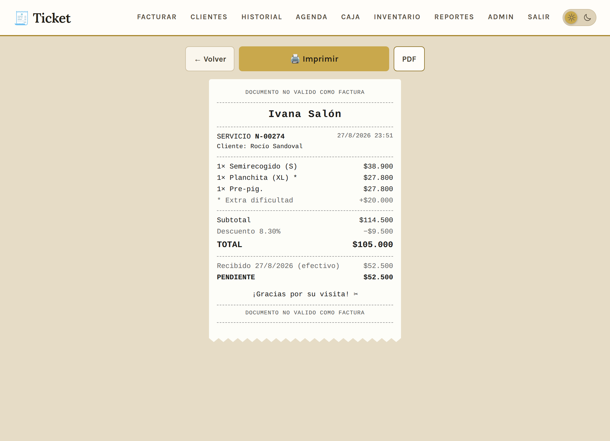
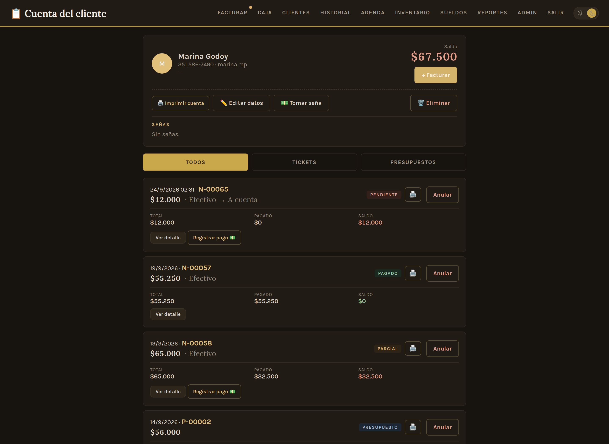
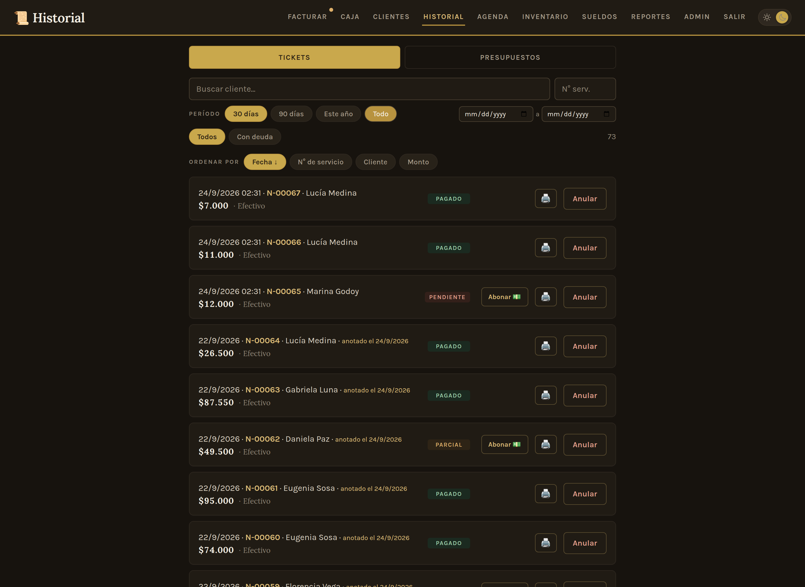
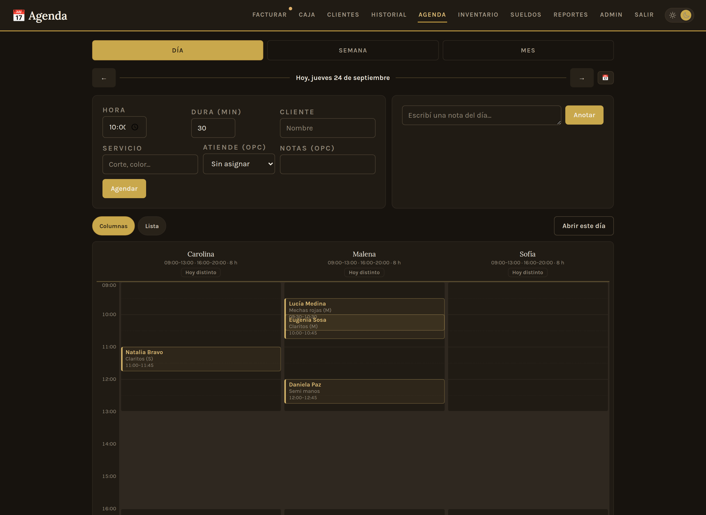
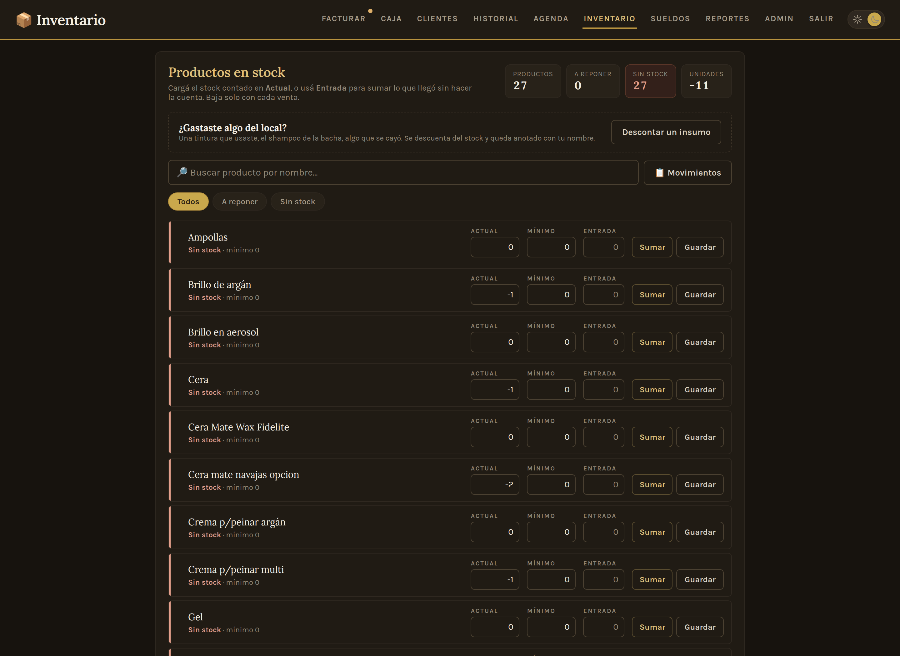

# Ivana Salón — Sistema de gestión para comercios

Aplicación web full-stack para la gestión diaria de una peluquería: facturación con cuenta corriente, clientes, agenda de turnos, caja, inventario, reportes y administración. **En producción y en uso diario real** desde una tablet en el local.

---

## 💡 El problema que resuelve

El comercio llevaba las ventas, los gastos, los turnos y el fiado de forma manual: cuadernos para escribir ventas, mensajes para anotar turnos y mucha memoria de los empleados jaja. Este sistema centraliza todo en una sola herramienta pensada para el día a día del local: cobra, imprime el comprobante, agenda, registra deudas de clientes, cierra la caja con arqueo de efectivo y muestra la evolución del negocio en gráficos.

---

## 📸 Capturas

### Facturación
Catálogo navegable por categorías con buscador. Cada ítem muestra sus dos precios (lista / con descuento). Sobre cada línea se puede aplicar un descuento o recargo propio, y abajo se suman *extras* —traslado, un producto que se lleva— que ningún descuento toca.


### Comprobante impreso
Vista previa de lo que sale por la comandera térmica de 80mm, calcada al papel real. El mismo botón manda los bytes ESC/POS por Bluetooth; el botón PDF es el plan B por el diálogo del navegador.

No es un documento fiscal y el papel lo dice: se titula «Comprobante», el número no usa las letras de las clases de factura y lleva al pie «Documento no válido como factura».



### Cuenta corriente
Ficha del cliente con sus comprobantes, saldos pendientes y registro de pagos parciales. Desde acá se saldan las deudas y se imprime el resumen de cuenta.



### Historial
Tickets y presupuestos emitidos, con búsqueda por cliente y por número, y filtros por deuda o por presupuestos ya convertidos. La lista se dibuja de a tramos para que la tablet no se arrastre.



### Agenda
Turnos en vista día, semana o mes. La vista día combina el formulario de turnos con un panel de notas del día, lado a lado.



### Caja
Cierre diario con ingresos y egresos por forma de pago, arqueo de efectivo con fondo inicial (con arrastre del último valor) y edición en línea de egresos.


### Inventario
Control de stock con una franja de estado por producto: lo que hay que reponer se ve sin leer una palabra. Las cantidades bajan solas con cada venta.



### Reportes
Resumen por período, evolución de la caja, ranking de lo más vendido, ingresos por forma de pago y deuda total. Los gráficos son SVG hechos a mano, sin librerías externas: la tablet del local puede quedarse sin internet y la pantalla sigue sirviendo.


---

## ✨ Funcionalidades

- **Facturación** — Catálogo por categorías con buscador en vivo y agrupado por variantes (talles). Dos listas de precios, descuento por comprobante, **descuento o recargo por línea**, **extras que ningún descuento toca**, recargo por dificultad, pago mixto y venta a cuenta. Registro de egresos en la misma pantalla.
- **Impresión térmica** — Comprobantes, presupuestos y resúmenes de cuenta por comandera Bluetooth de 80mm (ESC/POS, 48 columnas, acentos vía CP850), con vista previa en pantalla y salida a PDF como alternativa. No son documentos fiscales y el papel lo aclara. Ver [`docs/comandera.md`](docs/comandera.md).
- **Clientes y cuenta corriente** — Alta y búsqueda con teléfono y alias de transferencia, filtro de deudores. Ficha con comprobantes, saldos y pagos parciales: cada cliente tiene su historial completo con lo que debe y lo que pagó.
- **Historial** — Tickets y presupuestos con estado de pago, búsqueda por cliente y número, y filtros por deuda o conversión.
- **Presupuestos** — Se emiten con los dos precios a la vista y se convierten a ticket con un botón, descontando el stock recién en ese momento.
- **Agenda** — Turnos con vista día / semana / mes (lunes a domingo), cancelación y notas diarias.
- **Caja** — Cierre diario con ingresos/egresos por forma de pago, arqueo de efectivo con fondo por día (con arrastre), y edición/anulación sin salir de la pantalla.
- **Reportes** — Resumen por período, ranking de más vendidos, evolución temporal, deuda total y exportación a Excel.
- **Inventario** — Stock con alertas de reposición y carga de entradas de mercadería.
- **Administración** — ABM de productos, categorías, precios, descuentos, ajustes por ítem, formas de pago, alias, tipos de egreso y usuarios. Backup completo en JSON.
- **Modo claro / oscuro** — Se elige por dispositivo y queda guardado; sin elección propia, sigue al sistema operativo.

---

## 🛠️ Stack técnico

| Capa | Tecnologías |
|---|---|
| **Backend** | Python · FastAPI · SQLAlchemy (ORM) · Pydantic · Uvicorn (ASGI) |
| **Base de datos** | SQLite (desarrollo) · PostgreSQL (producción) |
| **Frontend** | HTML · CSS (tokens en capas) · JavaScript vanilla · SVG a mano para los gráficos |
| **Impresión** | ESC/POS sobre Bluetooth (app RawBT) · `@media print` para el PDF |
| **Autenticación** | Tokens firmados con HMAC (stateless) · hashing de contraseñas con PBKDF2 + salt |
| **Despliegue** | Railway (deploy automático desde GitHub) · variables de entorno para configuración |

**Cero dependencias de frontend.** No hay build step, ni `node_modules`, ni CDNs: el navegador recibe HTML, CSS y JS tal como están en el repo. Las tipografías se sirven desde la propia app. Es a propósito — abajo está el porqué.

---

## 🏗️ Arquitectura

Arquitectura **cliente-servidor desacoplada**: el backend expone una **API REST** que devuelve JSON, y el frontend (servido como archivos estáticos por el mismo servidor) consume esa API y renderiza la interfaz.

```
  Navegador (HTML + JS vanilla + SVG)
        │  HTTP / JSON  (fetch con token)
        ▼
  Uvicorn → FastAPI (main.py)
        ├── auth.py            (hashing + tokens firmados)
        ├── esquemas Pydantic  (validación de entrada/salida)
        └── SQLAlchemy (models.py) → SQLite / PostgreSQL

  Comprobante → bytes ESC/POS → RawBT → comandera Bluetooth 80mm
```

### Decisiones de diseño destacadas

- **Todo tiene que andar sin internet.** El local se queda sin conexión y la tablet tiene que seguir cobrando. Por eso no hay CDNs: los gráficos de Reportes son SVG dibujados a mano en vez de Chart.js, y las tipografías se sirven desde la app. Es la restricción que más decisiones explica en este proyecto.
- **El papel no se hace pasar por lo que no es:** el comprobante no es fiscal, así que no se titula "Ticket" (en Argentina es lo que emite un controlador fiscal), el número no arranca con las letras de las clases de factura, y al pie dice "Documento no válido como factura".
- **Totales calculados en el servidor:** el frontend nunca envía precios; el backend los resuelve contra su propia base. La interfaz muestra, pero el servidor tiene la última palabra (evita manipulación desde el cliente).
- **Snapshot de precios:** cada línea de venta guarda el nombre y el precio del momento, no solo una referencia al ítem. Cambiar un precio hoy no altera el historial de ventas pasadas.
- **Una sola lista de precios como fuente de verdad:** el precio efectivo es el base; el de transferencia se deriva con un factor y redondeo. Un solo lugar para cambiar precios, sin inconsistencias.
- **Los descuentos se apilan en un orden definido:** primero el ajuste de cada línea, después el descuento del comprobante, y los extras se suman al final —por definición, ningún descuento los toca.
- **Estado de deuda calculado, no almacenado:** el saldo de un comprobante se resuelve siempre a partir de sus pagos registrados. No hay un campo "deuda" que pueda quedar desincronizado.
- **Soft delete en cascada:** los ítems y comprobantes se marcan como inactivos en vez de borrarse; anular un comprobante anula sus pagos y devuelve el stock, para que la caja y los reportes cierren siempre.
- **Fondo de caja por día con arrastre:** cada día puede tener su propio fondo; si no lo tiene, hereda el del último día cargado, sin reescribir los anteriores.
- **Fechas en UTC, presentación en hora local:** la base guarda todo en UTC y la conversión a hora argentina se hace solo al mostrar. Los reportes y cierres de caja no se corren de día.
- **Listados que cargan en lote, no de a uno:** el estado de pago de una lista de comprobantes se resuelve trayendo todos los pagos de una y cruzándolos en memoria, en vez de una consulta por comprobante. Sobre 1.458 tickets reales eso bajó de 4.371 consultas y 1.427 ms a 3 consultas y 206 ms.
- **CSS con tokens en capas:** las variables de diseño (`tokens.css`) alimentan base, layout y componentes. El modo oscuro redefine tokens, nunca colores de componente: por eso entró sin tocar una sola pantalla. Los únicos cuatro `!important` del proyecto están para apagar animaciones (accesibilidad y cambio de tema) y para ocultar la interfaz al imprimir.
- **Autenticación stateless:** tokens firmados con HMAC que no requieren guardar sesión en el servidor (sobreviven a reinicios y escalan horizontalmente).

---

## 🚀 Correr en local

Requisitos: Python 3.10+

```bash
# 1. Crear y activar un entorno virtual ((opcional))
python -m venv venv
venv\Scripts\activate          # Windows
# source venv/bin/activate     # macOS / Linux

# 2. Instalar dependencias
pip install -r requirements.txt

# 3. Levantar el servidor (al iniciar siembra catálogo y usuarios si la base está vacía)
uvicorn main:app --reload --port 8000

# 4. Abrir en el navegador
#    http://127.0.0.1:8000/login
```

### Usuarios iniciales

| Usuario | Contraseña | Rol |
|---|---|---|
| `dueno` | `dueno1234` | Acceso total |
| `empleado` | `empleado1234` | Facturación y agenda |

Para acceder desde otro dispositivo en la misma red (ej: una tablet), levantar con `--host 0.0.0.0` y entrar a `http://[IP-de-la-PC]:8000`.

---

## ⚙️ Variables de entorno (producción)

| Variable | Descripción |
|---|---|
| `DATABASE_URL` | Cadena de conexión a PostgreSQL. Si no está definida, usa SQLite local. |
| `SECRET_KEY` | Clave secreta para firmar los tokens de sesión. **Obligatoria en producción.** |

El esquema se migra solo al arrancar: `migrar()` agrega las columnas que falten y SQLAlchemy crea las tablas nuevas. Es idempotente, así que sobrevive a los reinicios del contenedor.

---

## 📁 Estructura del proyecto

```
salon_ivana/
├── main.py            # API REST + rutas que sirven las pantallas + migraciones
├── models.py          # Modelos ORM (tablas de la base de datos)
├── database.py        # Conexión y sesión (SQLite local / PostgreSQL prod)
├── auth.py            # Hashing de contraseñas y tokens firmados
├── seed_datos.py      # Siembra inicial (catálogo + usuarios)
├── config_extra.py    # Parámetros de negocio iniciales
├── catalogo.json      # Catálogo de ítems iniciales
├── requirements.txt   # Dependencias de Python
├── Procfile           # Comando de arranque para el despliegue
├── docs/
│   └── comandera.md   # Cómo conectar la impresora térmica
└── static/            # Frontend
    ├── facturar.html  # Facturación y cobro
    ├── ticket.html    # Vista previa e impresión ESC/POS del comprobante
    ├── clientes.html  # Listado y alta de clientes
    ├── cuenta.html    # Cuenta corriente del cliente
    ├── historial.html # Historial de comprobantes
    ├── agenda.html    # Turnos y notas diarias
    ├── caja.html      # Caja y arqueo
    ├── reportes.html  # Reportes y gráficos
    ├── inventario.html
    ├── admin.html
    ├── login.html
    ├── auth.js        # Lógica de sesión compartida
    ├── tema.js        # Modo claro / oscuro
    ├── favicon.svg
    ├── fonts/         # Tipografías propias (para andar sin internet)
    └── css/           # tokens.css → base.css → layout.css → components.css → app.css
```

---

## 🗺️ Roadmap

Funcionalidades en evaluación / desarrollo:

- [x] Impresión de comprobantes con impresora térmica Bluetooth (ESC/POS, 80mm).
- [ ] Envío de comprobantes con datos del cliente para contaduría.
- [ ] Carga de mercadería desde las grillas de los proveedores, en vez de a mano.

---

## 👤 Sobre el proyecto y mi rol

Identifiqué la necesidad del comercio de mi amigo y diseñé el sistema a medida para sus preferencias. La app está en producción y se usa todos los días en el local; el dueño la prueba activamente y varias funcionalidades (como la agenda) surgieron de este ida y vuelta. Es mi primer proyecto de esta magnitud y estoy aprendiendo muchísimo mientras tanto.
