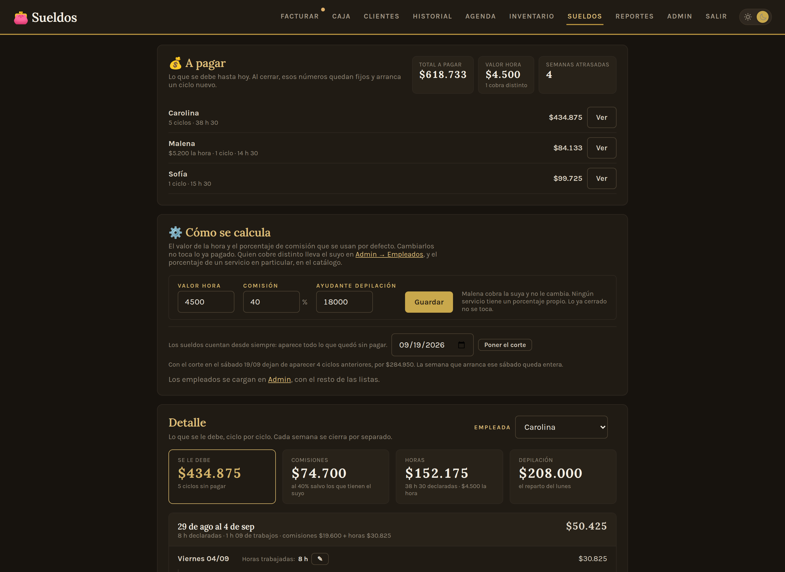
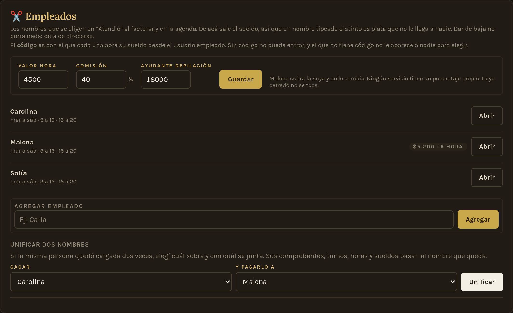

# Ivana Salón — Sistema de gestión para peluquería

Aplicación web full-stack para la gestión diaria de una peluquería: facturación con cuenta corriente, clientes, agenda de turnos, caja, inventario, sueldos por comisión, reportes y administración. **En producción y en uso diario real** desde una tablet en el local.

---

## 💡 El problema que resuelve

El comercio llevaba las ventas, los gastos, los turnos y el fiado de forma manual: cuadernos para escribir ventas, mensajes para anotar turnos y mucha memoria de los empleados jaja. Este sistema centraliza todo en una sola herramienta pensada para el día a día del local: cobra, imprime el comprobante, agenda, registra deudas de clientes, cierra la caja con arqueo de efectivo, calcula lo que se le debe a cada empleada y muestra la evolución del negocio en gráficos.

---

## 📸 Capturas

Están en modo oscuro, que es como se usa en el local: la tablet vive prendida sobre el mostrador y de noche el blanco encandila. Los nombres y los números son de una base de ejemplo.

### Facturación
Catálogo navegable por categorías con buscador. Cada ítem muestra sus dos precios (lista / con descuento). Sobre cada línea se puede aplicar un descuento o recargo propio, y abajo se suman *extras* —traslado, un producto que se lleva— que ningún descuento toca.


### Comprobante impreso
Vista previa de lo que sale por la comandera térmica de 80mm, calcada al papel real. El mismo botón manda los bytes ESC/POS por Bluetooth; el botón PDF es el plan B por el diálogo del navegador.

No es un documento fiscal y el papel lo dice: se titula «Comprobante», el número no usa las letras de las clases de factura y lleva al pie «Documento no válido como factura».


### Cuenta corriente
Ficha del cliente con sus comprobantes, saldos pendientes y registro de pagos parciales. Desde acá se saldan las deudas y se imprime el resumen de cuenta.


### Historial
Tickets y presupuestos emitidos, con búsqueda por cliente y por número, y filtros por deuda o por presupuestos ya convertidos. La lista se pide al servidor de a páginas, acotada a un período: arranca en los últimos 30 días y salta sola a todo el historial cuando buscás, para que la tablet no tenga que traerse mil comprobantes cada vez que se abre la pantalla.


### Agenda
Turnos en vista día, semana o mes. El día se dibuja **por columnas, una por empleada**, con el horario de cada una pintado de fondo: se ve de un vistazo quién está, hasta cuándo y qué hueco queda. La ventana de horas no es una constante, sale del día: de lo más temprano que alguien entra a lo más tarde que alguien sale.

Un día suelto se puede abrir fuera del horario de siempre —el lunes de depilación, que el local abre una vez al mes— sin tocar el horario fijo de nadie.


### Caja
Cierre diario con ingresos y egresos por forma de pago, arqueo de efectivo con fondo inicial (con arrastre del último valor) y edición en línea de egresos.


### Inventario
Control de stock con una franja de estado por producto: lo que hay que reponer se ve sin leer una palabra. Las cantidades bajan solas con cada venta.


### Reportes
Resumen por período, evolución de la caja, ranking de lo más vendido, ingresos por forma de pago y deuda total. Los gráficos son SVG hechos a mano, sin librerías externas: la tablet del local puede quedarse sin internet y la pantalla sigue sirviendo.


### Sueldos
Lo que se le debe a cada empleada, ciclo por ciclo. El ciclo de pago va de sábado a viernes y se arma en vivo con lo que está pendiente: las comisiones salen de los tickets donde figura como quien atendió, y las horas las declara ella misma desde su propia pantalla, con un código propio que se pide cada vez.

La comisión se calcula sobre lo que la clienta terminó pagando por ese trabajo. Un ciclo no se puede cerrar si falta la duración de un trabajo o las horas de un día: hasta que estén, el número sería mentira para los dos lados. Al cerrar, la foto queda fija —cada liquidación guarda el valor hora y el porcentaje con los que se pagó— y el egreso del sueldo se anota solo en la caja.



### Empleados y horarios
Cada persona con su horario semanal, su código de sueldo y, si cobra distinto, su propio valor hora. El horario se le puede poner a varias de una sola vez, marcando a quiénes y qué días: se reemplazan solo esos días y el resto de la semana de cada una queda como estaba.

Los números generales —valor hora, comisión— son un respaldo, no un valor que se copie: quien tiene el suyo lo conserva, y la pantalla lo dice antes de guardar.



---

## ✨ Funcionalidades

- **Facturación** — Catálogo por categorías con buscador en vivo y agrupado por variantes (talles). Dos listas de precios, descuento por comprobante, **descuento o recargo por línea** (en porcentaje o en pesos), **extras que ningún descuento toca**, pago mixto y venta a cuenta. **Imprime el papel solo al terminar de cobrar**, y permite anotar un servicio de un día anterior sin desordenar la caja. Registro de egresos en la misma pantalla.
- **Impresión térmica** — Comprobantes, presupuestos y resúmenes de cuenta por comandera Bluetooth de 80mm (ESC/POS, 48 columnas, acentos vía CP850), con vista previa en pantalla y salida a PDF como alternativa. No son documentos fiscales y el papel lo aclara. Ver [`docs/comandera.md`](docs/comandera.md).
- **Clientes y cuenta corriente** — Alta y búsqueda con teléfono y alias de transferencia, filtro de deudores. Ficha con comprobantes, saldos y pagos parciales: cada cliente tiene su historial completo con lo que debe y lo que pagó.
- **Historial** — Tickets y presupuestos con estado de pago, búsqueda por cliente y número, y filtros por deuda o conversión. Paginado en el servidor: arranca en los últimos 30 días y buscar mira todo el historial, de cualquier fecha y año.
- **Presupuestos** — Se emiten con los dos precios a la vista y se convierten a ticket con un botón, descontando el stock recién en ese momento.
- **Agenda** — Turnos con vista día / semana / mes, cancelación y notas diarias. El día va por columnas, una por empleada, con su horario de fondo. El horario fijo se carga en Admin y cada día suelto se corrige desde la agenda; un día entero se puede abrir fuera del horario de siempre.
- **Sueldos y comisiones** — Ciclos de sábado a viernes armados en vivo con lo que está pendiente. Comisión por trabajo sobre lo que la clienta terminó pagando, horas declaradas por la propia empleada con su código, y trabajos sueltos para lo que no quedó en ningún ticket. El cierre saca una foto —guarda el valor hora y el porcentaje del momento— y anota el egreso del sueldo en la caja. Cada empleada puede tener su propio valor hora, y cada servicio su propio porcentaje.
- **Lunes de depilación** — Un día al mes el local abre solo para depilación y ese día no se paga por comisión: se reparte. Recaudado del día menos sus gastos, mitad para quien lo lleva y mitad para el salón. Los gastos del día —insumos, el pago a la ayudante— se cargan desde la misma pantalla, y quien ayudó ve en la suya cuánto cobró, sin ciclo ni cierre.
- **Señas** — Plata que la clienta adelanta, sin atarla a ningún ticket. Entra a la caja del día en que se cobra y se aplica sola al facturarle. No se cuenta dos veces: el abono que genera no vuelve a sumar como plata del día.
- **Caja** — Cierre diario con ingresos/egresos por forma de pago, arqueo de efectivo con fondo por día (con arrastre), y edición/anulación sin salir de la pantalla.
- **Reportes** — Resumen por período, ranking de más vendidos, evolución temporal, deuda total y exportación a Excel.
- **Inventario** — Stock con alertas de reposición y carga de entradas de mercadería.
- **Administración** — ABM de productos, categorías, precios, descuentos, ajustes por ítem, formas de pago, alias, tipos de egreso, empleados con su horario y usuarios. Backup completo en JSON. Las listas del día a día las maneja también el empleado; los usuarios y el backup, solo la dueña. Cada lista se edita fila por fila, y también desde el lapicito que hay al lado del desplegable donde se usa: si falta un descuento en medio de un cobro, se carga ahí sin salir de Facturación.
- **Modo claro / oscuro** — Se elige por dispositivo y queda guardado; sin elección propia, sigue al sistema operativo.

---

## 🛠️ Stack técnico

| Capa | Tecnologías |
|---|---|
| **Backend** | Python · FastAPI · SQLAlchemy (ORM) · Pydantic · Uvicorn (ASGI) |
| **Base de datos** | SQLite (desarrollo) · PostgreSQL (producción) |
| **Frontend** | HTML · CSS (tokens en capas) · JavaScript vanilla · SVG a mano para los gráficos |
| **Impresión** | ESC/POS sobre Bluetooth (app RawBT) · `@media print` para el PDF |
| **Autenticación** | Tokens firmados con HMAC (stateless) · hashing de contraseñas con PBKDF2 + salt |
| **Despliegue** | Railway (deploy automático desde GitHub) · variables de entorno para configuración |

**Cero dependencias de frontend.** No hay build step, ni `node_modules`, ni CDNs: el navegador recibe HTML, CSS y JS tal como están en el repo. Las tipografías se sirven desde la propia app. Es a propósito — abajo está el porqué.

---

## 🏗️ Arquitectura

Arquitectura **cliente-servidor desacoplada**: el backend expone una **API REST** que devuelve JSON, y el frontend (servido como archivos estáticos por el mismo servidor) consume esa API y renderiza la interfaz.

```
  Navegador (HTML + JS vanilla + SVG)
        │  HTTP / JSON  (fetch con token)
        ▼
  Uvicorn → FastAPI (main.py)
        ├── auth.py            (hashing + tokens firmados)
        ├── esquemas Pydantic  (validación de entrada/salida)
        └── SQLAlchemy (models.py) → SQLite / PostgreSQL

  Comprobante → bytes ESC/POS → RawBT → comandera Bluetooth 80mm
```

### Decisiones de diseño destacadas

- **Todo tiene que andar sin internet.** El local se queda sin conexión y la tablet tiene que seguir cobrando. Por eso no hay CDNs: los gráficos de Reportes son SVG dibujados a mano en vez de Chart.js, y las tipografías se sirven desde la app. Es la restricción que más decisiones explica en este proyecto.
- **El papel no se hace pasar por lo que no es:** el comprobante no es fiscal, así que no se titula "Ticket" (en Argentina es lo que emite un controlador fiscal), el número no arranca con las letras de las clases de factura, y al pie dice "Documento no válido como factura".
- **Totales calculados en el servidor:** el frontend nunca envía precios; el backend los resuelve contra su propia base. La interfaz muestra, pero el servidor tiene la última palabra (evita manipulación desde el cliente).
- **Snapshot de precios:** cada línea de venta guarda el nombre y el precio del momento, no solo una referencia al ítem. Cambiar un precio hoy no altera el historial de ventas pasadas.
- **Una sola lista de precios como fuente de verdad:** el precio efectivo es el base; el de transferencia se deriva con un factor y redondeo. Un solo lugar para cambiar precios, sin inconsistencias.
- **Los descuentos se apilan en un orden definido:** primero el ajuste de cada línea, después el descuento del comprobante, y los extras se suman al final —por definición, ningún descuento los toca.
- **Estado de deuda calculado, no almacenado:** el saldo de un comprobante se resuelve siempre a partir de sus pagos registrados. No hay un campo "deuda" que pueda quedar desincronizado.
- **Soft delete en cascada:** los ítems y comprobantes se marcan como inactivos en vez de borrarse; anular un comprobante anula sus pagos y devuelve el stock, para que la caja y los reportes cierren siempre.
- **Fondo de caja por día con arrastre:** cada día puede tener su propio fondo; si no lo tiene, hereda el del último día cargado, sin reescribir los anteriores.
- **Fechas en UTC, presentación en hora local:** la base guarda todo en UTC y la conversión a hora argentina se hace solo al mostrar. Los reportes y cierres de caja no se corren de día.
- **Listados que cargan en lote, no de a uno:** el estado de pago de una lista de comprobantes se resuelve trayendo todos los pagos de una y cruzándolos en memoria, en vez de una consulta por comprobante. Sobre 1.458 tickets reales eso bajó de 4.371 consultas y 1.427 ms a 3 consultas y 206 ms.
- **CSS con tokens en capas:** las variables de diseño (`tokens.css`) alimentan base, layout y componentes. El modo oscuro redefine tokens, nunca colores de componente: por eso entró sin tocar una sola pantalla. Los únicos cuatro `!important` del proyecto están para apagar animaciones (accesibilidad y cambio de tema) y para ocultar la interfaz al imprimir.
- **Autenticación stateless:** tokens firmados con HMAC que no requieren guardar sesión en el servidor (sobreviven a reinicios y escalan horizontalmente).
- **Los ciclos de sueldo se calculan en vivo, no se guardan:** mientras algo está pendiente todavía puede cambiar —se corrige un comprobante y el número se corrige solo—. Recién al cerrar se saca la foto, con el valor hora y el porcentaje de ese día adentro. Y un ciclo no es una ventana de fechas sino "todo lo que estaba pendiente": con ventanas siempre hay algo que queda afuera, y en un sueldo eso es plata que se pierde sin que nadie se entere.
- **La plata se cuenta una sola vez, y hay un solo lugar donde se cuenta:** todo lo que suma dinero por fecha —caja, reportes, el Excel, los gráficos— pasa por la misma función. Una seña ya entró a la caja el día que se cobró, así que el abono que genera al facturar no vuelve a sumar. Contándola dos veces, el arqueo pide más efectivo del que hay en el cajón y no avisa por qué.
- **Un día de depilación no paga comisión a nadie:** el día se reparte entero, así que lo que se atendió ahí ya está adentro del reparto. Sin esa regla, quien ayudó cobraba su parte del día *y además* la comisión de lo que atendió, y el local pagaba dos veces el mismo trabajo.
- **Lo que no se puede deshacer se usa lo menos posible:** una liquidación es una foto y no tiene vuelta atrás, así que el pago a la ayudante del lunes se anota como un egreso —que sí se anula— en vez de como un cierre. Por la misma razón, "arrancar los sueldos de cero desde tal día" es un corte que deja de mostrar lo anterior, no un borrado: correrlo para atrás devuelve todo.
- **Argentina es UTC−3 todo el año:** el servidor corre en UTC, así que a partir de las 21:00 argentinas ya está en el día siguiente. Todas las fechas de negocio pasan por un par de funciones que traducen "hoy" y "el rango de este día"; usar la fecha del sistema directamente hacía que un gasto cargado a las 21:23 apareciera en la caja del día siguiente.
- **Un solo generador para el papel:** la vista de impresión y la pantalla de cobro comparten el mismo módulo ESC/POS. Con dos, un día el papel que sale al cobrar dice algo distinto del que sale al reimprimir.
- **`Cache-Control` explícito:** sin él, el navegador no pregunta si el archivo cambió, adivina. En una tablet que queda abierta días eso significaba seguir usando el CSS y el JS de la semana pasada, y explicaba dos quejas que parecían bugs distintos. Hoy el HTML, el CSS y el JS van con `no-cache` (guardalo, pero preguntá siempre, y el ETag contesta 304 vacío) y las tipografías con un año.

---

## 🚀 Correr en local

Requisitos: Python 3.10+

```bash
# 1. Crear y activar un entorno virtual ((opcional))
python -m venv venv
venv\Scripts\activate          # Windows
# source venv/bin/activate     # macOS / Linux

# 2. Instalar dependencias
pip install -r requirements.txt

# 3. Levantar el servidor (al iniciar siembra catálogo y usuarios si la base está vacía)
uvicorn main:app --reload --port 8000

# 4. Abrir en el navegador
#    http://127.0.0.1:8000/login
```

### Usuarios iniciales

| Usuario | Contraseña | Rol |
|---|---|---|
| `dueno` | `dueno1234` | Acceso total |
| `empleado` | `empleado1234` | Todo salvo reportes, usuarios, backup y el stock |

Hay **un usuario por rol**: una dueña y un empleado. El sistema no deja crear un
segundo del mismo rol, porque con dos cuentas "empleado" deja de saberse quién
anotó cada cosa y la contraseña termina siendo la misma para todos.

Las empleadas no son usuarios: son una tabla aparte, con un **código de cuatro a
ocho dígitos** para abrir su sueldo desde el usuario empleado. En el local hay una
sola tablet y un solo login, así que sin ese código el sueldo de una queda a la
vista de la otra. El código no se guarda en el navegador —el permiso vive en
memoria mientras la pantalla está abierta—, se frena por intentos como el login, y
la pantalla se cierra sola cuando deja de estar a la vista o pasan unos minutos
sin que nadie la toque.

### Qué ve cada rol

| | Dueña | Empleado |
|---|---|---|
| Facturar, clientes, agenda, historial | ✅ | ✅ |
| Anotar un servicio con fecha de otro día | ✅ | ❌ |
| Caja del día y arqueo | ✅ | ✅ (sin los egresos privados) |
| Fondo inicial de caja | ✅ | ❌ |
| Inventario | edita | solo lee las cantidades |
| Admin: catálogo, formas de pago, tipos de egreso, descuentos, ajustes por ítem, alias | ✅ | ✅ |
| Admin: empleados y horarios | ✅ | ❌ |
| Admin: usuarios y backup | ✅ | ❌ |
| Reportes | ✅ | ❌ |
| Sueldos: ver el suyo y cargar sus horas | ✅ (todas) | ✅ (solo el suyo, con código) |
| Sueldos: cerrar un ciclo y pagar | ✅ | ❌ |

**Egresos privados.** El alquiler y los sueldos se anotan como cualquier otro
egreso, pero marcados privados: no aparecen en la lista del empleado ni suman en
los totales de *su* caja. Se marcan de dos formas que se complementan: la casilla
al cargar el egreso (viene tildada para la dueña) y el tipo de egreso marcado
como privado en Admin, que la tilda solo y no deja destildarla. Un egreso cargado
por el empleado nunca es privado, aunque le ponga un nombre de tipo reservado:
esconderle lo que él mismo acaba de anotar le dejaría el arqueo sin explicación.
Si el egreso privado es en efectivo, la pantalla avisa que el arqueo del empleado
va a dar de más por ese monto.

Para acceder desde otro dispositivo en la misma red (ej: una tablet), levantar con `--host 0.0.0.0` y entrar a `http://[IP-de-la-PC]:8000`.

### Dos utilidades para desarrollar

Las dos se niegan a trabajar contra cualquier cosa que no sea `127.0.0.1`: escriben en la base y una de ellas la recrea, así que el día que alguien las corra apuntando sin querer a producción, el que avisa del problema llega tarde.

```bash
# Abrir una copia de producción en la máquina de uno.
python levantar_local.py --dump copia.dump    # restaura un pg_dump en un PostgreSQL local
python levantar_local.py --json backup.json   # mete el JSON de /api/backup en un SQLite
python levantar_local.py --a-json copia.dump  # pasa el .dump a JSON, que es lo que se puede llevar

# Cargar un ciclo entero de trabajo para mirar la pantalla de Sueldos con números.
python simular_sueldos.py                     # factura por la API, como un cobro de verdad
python simular_sueldos.py --borrar            # deshace lo que cargó
```

`levantar_local.py` deja un usuario `local` / `local1234`: el backup trae los usuarios de producción y sus contraseñas no las sabe nadie, porque lo que se guarda es el hash.

---

## ⚙️ Variables de entorno (producción)

| Variable | Descripción |
|---|---|
| `DATABASE_URL` | Cadena de conexión a PostgreSQL. Si no está definida, usa SQLite local. |
| `SECRET_KEY` | Clave secreta para firmar los tokens de sesión. **Obligatoria en producción.** |

El esquema se migra solo al arrancar: `migrar()` agrega las columnas que falten y SQLAlchemy crea las tablas nuevas. Es idempotente, así que sobrevive a los reinicios del contenedor.

---

## 📁 Estructura del proyecto

```
salon_ivana/
├── main.py                # API REST + rutas que sirven las pantallas + migraciones
├── models.py              # Modelos ORM (tablas de la base de datos)
├── database.py            # Conexión y sesión (SQLite local / PostgreSQL prod)
├── auth.py                # Hashing de contraseñas y tokens firmados
├── seed_datos.py          # Siembra inicial (catálogo + usuarios), idempotente
├── config_extra.py        # Datos del negocio (se importan en vivo, no están en la base)
├── catalogo.json          # Catálogo de ítems iniciales
├── restaurar_backup.py    # Sube un backup JSON a una base
├── levantar_local.py      # Abre una copia de producción en la máquina de uno
├── simular_sueldos.py     # Carga un ciclo de trabajo para probar Sueldos con números
├── requirements.txt
├── Procfile               # Comando de arranque para el despliegue
├── docs/
│   └── comandera.md       # Cómo conectar la impresora térmica
└── static/                # Frontend
    ├── facturar.html      # Facturación y cobro
    ├── ticket.html        # Vista previa e impresión ESC/POS del comprobante
    ├── clientes.html      # Listado y alta de clientes
    ├── cuenta.html        # Cuenta corriente del cliente
    ├── historial.html     # Historial de comprobantes
    ├── agenda.html        # Turnos por columnas, horarios y notas del día
    ├── caja.html          # Caja y arqueo
    ├── sueldos.html       # Ciclos, comisiones, horas y liquidaciones
    ├── reportes.html
    ├── inventario.html
    ├── admin.html
    ├── login.html
    ├── auth.js            # Sesión, menú y helpers compartidos
    ├── escpos.js          # Generador ESC/POS (lo usan ticket.html y facturar.js)
    ├── tema.js            # Modo claro / oscuro
    ├── fonts/             # Tipografías propias (para andar sin internet)
    ├── js/
    │   ├── facturar.js
    │   ├── admin.js
    │   ├── sueldos.js
    │   ├── senas.js
    │   ├── peluquero.js
    │   ├── listas.js      # Un solo dibujante para las cinco listas configurables,
    │   │                  #   que usan Admin y el lapicito de cada desplegable
    │   └── generales.js   # Ídem para el valor hora, la comisión y el pago a la ayudante
    └── css/               # tokens.css → base.css → layout.css → components.css → app.css
        ├── facturar.css   # (se cargan después de app.css, en la propia pantalla)
        └── admin.css
```

---

## 🗺️ Roadmap

Funcionalidades en evaluación / desarrollo:

- [x] Impresión de comprobantes con impresora térmica Bluetooth (ESC/POS, 80mm).
- [x] Agenda por columnas con el horario de cada empleada.
- [x] Sueldos: comisiones por trabajo, horas declaradas y cierre de ciclo.
- [ ] Un turno atendido por más de una persona, repartido en horarios.
- [ ] Envío de comprobantes con datos del cliente para contaduría.
- [ ] Carga de mercadería desde las grillas de los proveedores, en vez de a mano.

---

## 👤 Sobre el proyecto y mi rol

Identifiqué la necesidad del comercio de mi amigo y diseñé el sistema a medida para sus preferencias. La app está en producción y se usa todos los días en el local; el dueño la prueba activamente y varias funcionalidades (como la agenda) surgieron de este ida y vuelta. Es mi primer proyecto de esta magnitud y estoy aprendiendo muchísimo mientras tanto.
